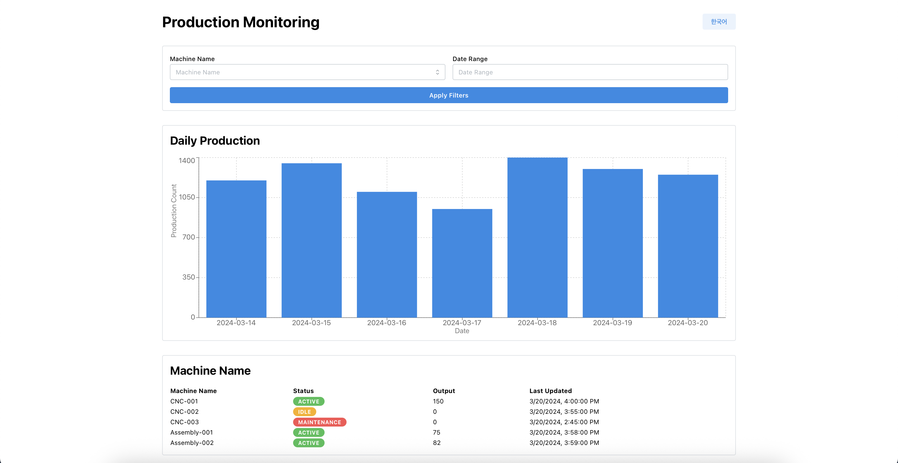
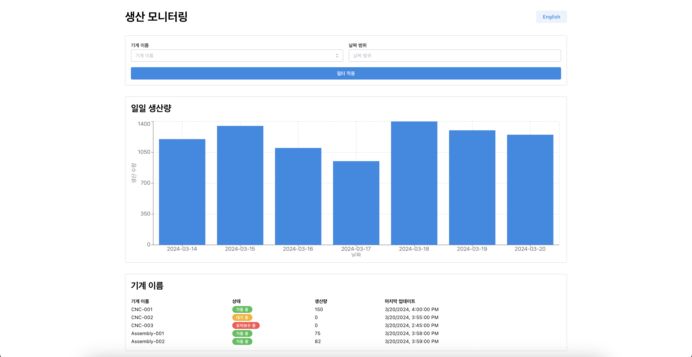

# Smart Factory Production Monitoring Dashboard

A lightweight smart factory dashboard UI built with React, TypeScript, Mantine, Recharts, React Query, and i18n. This dashboard allows you to monitor production data, filter by machine and date range, and switch between English and Korean languages.

## Features
- Responsive layout using Mantine UI
- Filter by machine name and date range
- Daily production chart (Recharts)
- Production data table (Mantine Table)
- Data fetching with React Query (using Mocky.io endpoints)
- Internationalization (English/Korean) with react-i18next
- Language switcher

## Screenshots

### English Dashboard


### Korean Dashboard


## Getting Started

1. Install dependencies:
   ```sh
   npm install
   ```
2. Start the development server:
   ```sh
   npm run dev
   ```
3. Open [http://localhost:5173](http://localhost:5173) in your browser.

## Project Structure
- `src/components/` - Main UI components
- `src/data/` - Type definitions and constants
- `src/i18n/` - Internationalization setup
- `src/assets/` - Project screenshots and images


<div align="center">
  <strong>Made with ❤️ by Sarvagna</strong>
</div> 

